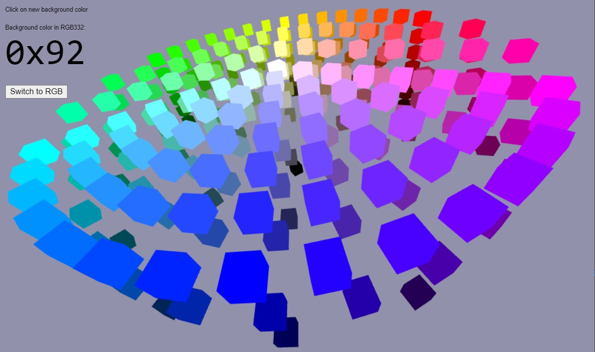

# RGB332 Color Wheel Using three.js

[CLICK HERE](https://roger-random.github.io/RGB332_color_wheel_three.js/)
to access it via GitHub Pages.

## Purpose

An interactive color picker for
[8-bit RGB332 colors](https://github.com/Roger-random/ESP_8_BIT_composite#8-bit-color)
with colors arranged in either a
[HSV color cylinder](https://en.wikipedia.org/wiki/HSL_and_HSV)
or a
[RGB color cube](https://en.wikipedia.org/wiki/RGB_color_space)
built using the
[three.js](https://threejs.org) 3D framework.

Designed as a tool to help users of
[ESP_8_BIT Color Composite Video Out Library](https://github.com/Roger-random/ESP_8_BIT_composite)

## Directory

Sharing this project with the world
* `README.md` - this file
* `LICENSE` - permissive MIT license
* `HSVcylinderRGB332.jpg` - screenshot of application

Color picker web app
* `docs/index.html` - HTML with inline CSS
* `docs/js/color_wheel.js` - JavaScript for interactive color picker

Snapshot of files from Three.js 3D framework
* `docs/js/three.js`
* `docs/js/OrbitControls.js`

For local testing and development, the following files launch a Docker
container to run nginx web server. Configured to send headers telling browsers
not to cache files so edits can be instantly visible upon reload. Once
Docker and Docker Compose is installed, launch by typing
`docker compose up` then point browser to
[`http://localhost:8332`](http://localhost:8332)
* `default.conf` -- nginx configuration file with no-cache headers
* `Dockerfile` -- Builds a nginx container with our own `default.conf`
* `docker-compose.yml` -- Launch Docker for self-hosting, builds container if
necessary.
